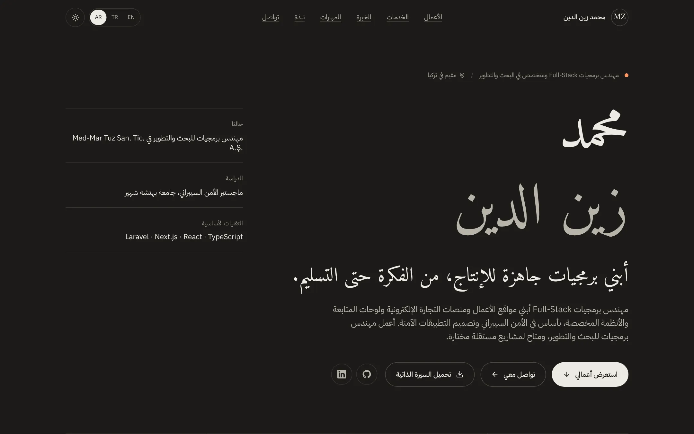
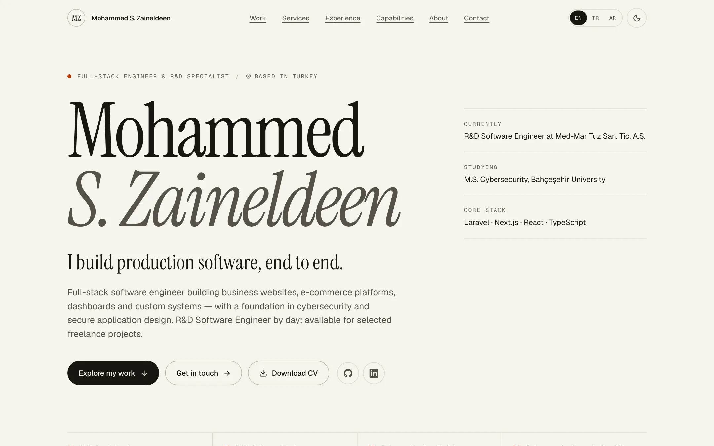
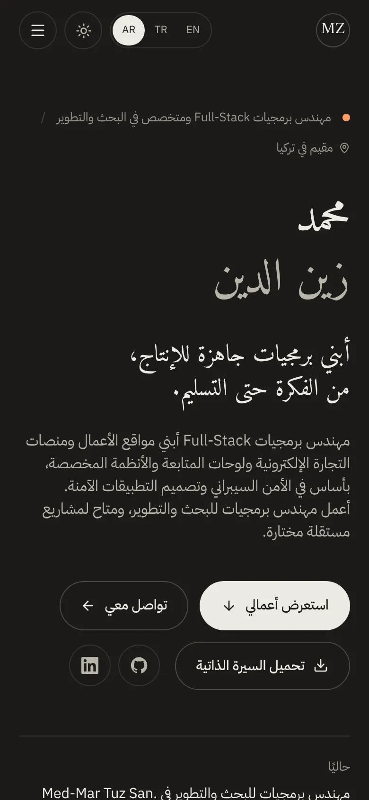
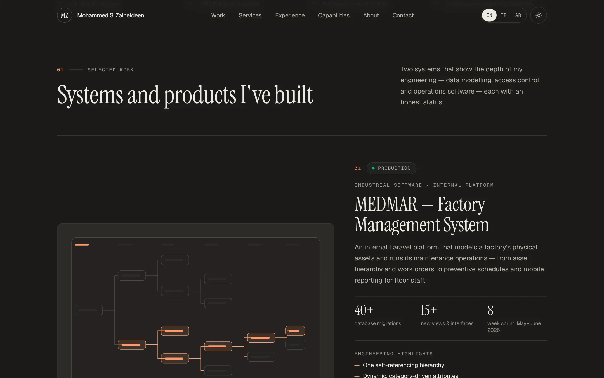
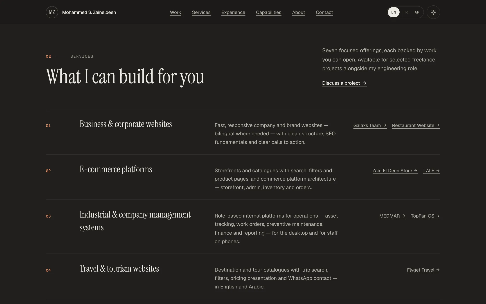
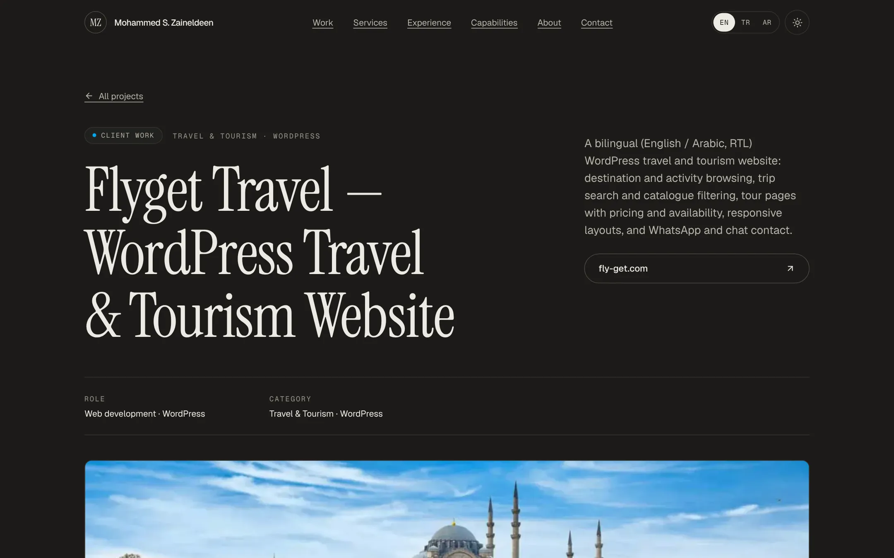
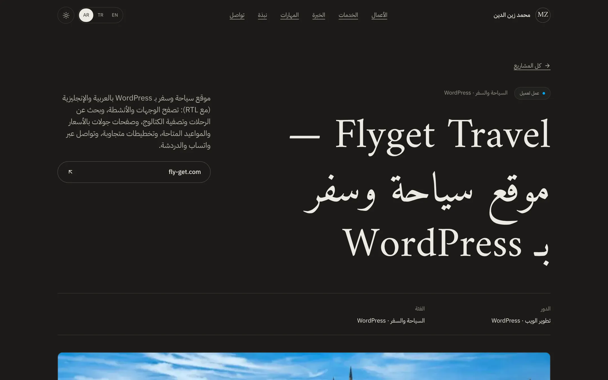

# Mohammed S. Zaineldeen — Portfolio

Portfolio of a full-stack / R&D software engineer and freelance developer who builds business websites, e-commerce platforms, dashboards and custom systems.

**Live:** https://mohammed-portfolio-phi.vercel.app


| Home — Arabic (RTL) | Light theme | Mobile (EN / AR) |
| --- | --- | --- |
|  |  |   |

| Flagship work | Services | Project gallery (filters + search) |
| --- | --- | --- |
|  |  |  |

| Flyget Travel case study | Gallery + lightbox | Arabic case study |
| --- | --- | --- |
|  |  |  |

## Features
- Homepage story: hero → three flagship systems (ordered by technical depth, each with an honest status) → further client work, demos and concepts → seven focused services → experience, capabilities, education, contact
- Filterable, searchable project gallery; a dedicated case study per project with real screenshots (desktop and mobile), keyboard-accessible lightbox, before/after slider, tech stack, features, engineering decisions and verified outcomes
- Honest project statuses: Production, Functional · private, Client work, Demo, In development, Concept, Personal
- English, Turkish and **Arabic with full RTL** (Arabic fonts load lazily; directional icons mirror; Latin terms stay isolated inside Arabic text)
- Soft warm-charcoal dark theme and a polished light theme (persisted, follows the OS by default)
- SEO: per-page metadata, canonical/hreflang for three locales, Open Graph images, sitemap, robots, JSON-LD
- Accessible and fast: semantic HTML, skip link, visible focus, reduced-motion support, optimised WebP images, no tracking, axe-core clean (WCAG 2.1 AA) in both themes and all locales

## Tech stack
Next.js 16 (App Router, static generation) · React 19 · TypeScript · Tailwind CSS v4 · lucide-react · Geist + Instrument Serif fonts. Build/content tooling: sharp and playwright-core (dev only). No database, CMS or backend.

## Run locally
```bash
npm install
npm run dev        # http://localhost:3000
npm run check      # validate content (incl. Arabic coverage) + lint + typecheck + production build
```

## Content
All content lives in `src/data/` (typed). Projects, categories, screenshots and links come from **one** place, `src/data/projects.ts`; adding a project means adding its images and one object. `npm run validate` (also run before every build) checks slugs, statuses, categories, https links, alt text, related projects, that featured projects have real screenshots, and that every localized field has an Arabic translation. See [PORTFOLIO_CONTENT_GUIDE.md](./PORTFOLIO_CONTENT_GUIDE.md).

```
src/data/        projects, labs, services, experience, skills, education, certifications, profile
src/components/  layout, sections, project (cards, filter, lightbox, before/after), ui
src/i18n/        locales (en, tr, ar), UI dictionaries
public/projects/<slug>/   cover.webp, 01.webp…, m-01.webp (mobile), og.jpg
public/cv/                Mohammed-Zaineldeen-CV.pdf
scripts/         validate-content, capture/process screenshots, generate-cv
```

## Screenshots and CV
Screenshots are captured from the real sites and converted to WebP by `scripts/capture-screenshots.mjs` and `scripts/process-screenshots.mjs`. The CV is rendered from the `/resume` page by `npm run cv`; replace `public/cv/Mohammed-Zaineldeen-CV.pdf` with your own PDF at any time.

## Deployment (Vercel)
Import the repository into Vercel (framework: Next.js, no settings needed). Pushes to `main` deploy to production; other branches get preview URLs. Optionally set `NEXT_PUBLIC_SITE_URL` (see `.env.example`) when using a custom domain.

## Notes
Confidential employer information (source, URLs, data, personnel) is intentionally not published. Demo projects are labelled as demos.
