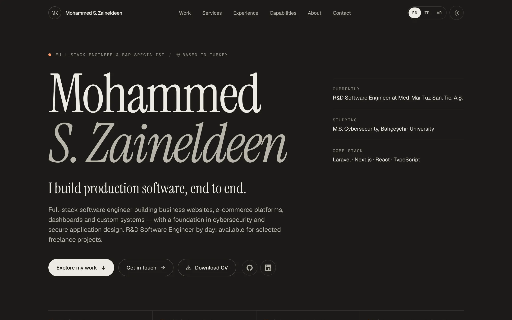
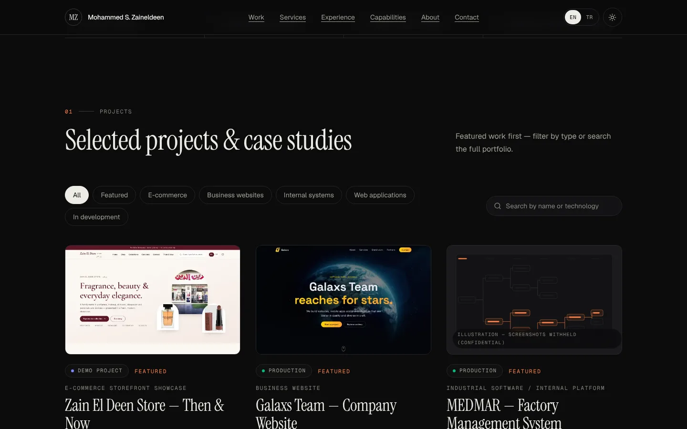
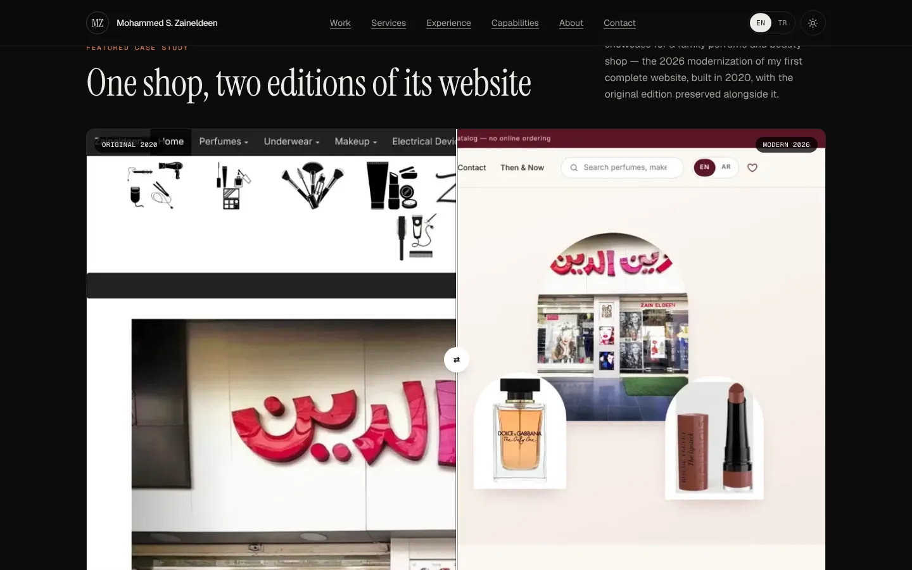
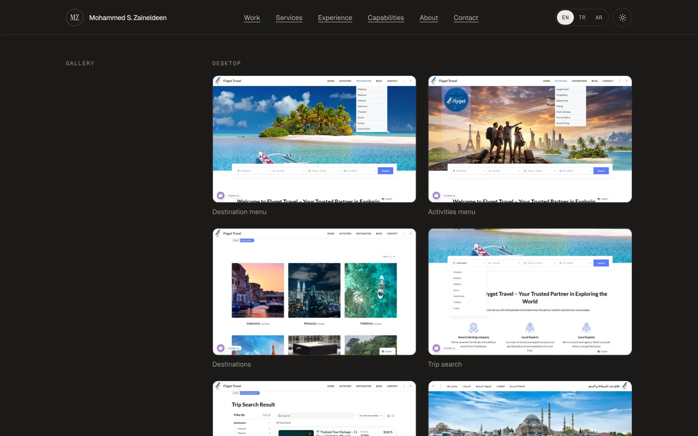
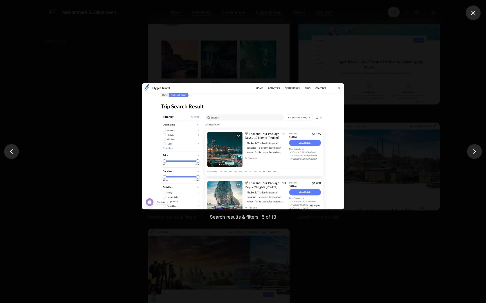
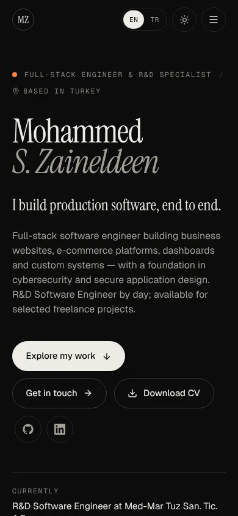

# Mohammed S. Zaineldeen — Portfolio

Portfolio of a full-stack / R&D software engineer and freelance developer who builds business websites, e-commerce platforms, dashboards and custom systems.

**Live:** https://mohammed-portfolio-phi.vercel.app



| Project gallery (filter + search) | Before / after case study |
| --- | --- |
|  |  |

| Case-study gallery | Lightbox | Mobile |
| --- | --- | --- |
|  |  |  |

## Features
- Filterable, searchable project gallery (Featured, E-commerce, Business websites, Internal systems, Web applications, In development)
- A dedicated case study per project with real screenshots (desktop and mobile), keyboard-accessible lightbox, before/after slider, tech stack, features, engineering decisions and verified outcomes
- Honest project statuses: Production, Demo, In development, Concept, Client work
- Services, experience timeline, grouped skills (no percentage bars), education, certifications, downloadable CV (A4 PDF generated from the same data)
- Dark and light themes (persisted), English and Turkish, RTL-ready layout
- SEO: per-page metadata, canonical/hreflang, Open Graph images, sitemap, robots, JSON-LD
- Accessible and fast: semantic HTML, skip link, visible focus, reduced-motion support, optimised WebP images, no tracking

## Tech stack
Next.js 16 (App Router, static generation) · React 19 · TypeScript · Tailwind CSS v4 · lucide-react · Geist + Instrument Serif fonts. Build/content tooling: sharp and playwright-core (dev only). No database, CMS or backend.

## Run locally
```bash
npm install
npm run dev        # http://localhost:3000
npm run check      # validate content + lint + typecheck + production build
```

## Content
All content lives in `src/data/` (typed). Projects, categories, screenshots and links come from **one** place, `src/data/projects.ts`; adding a project means adding its images and one object. `npm run validate` (also run before every build) checks slugs, statuses, categories, https links, alt text, related projects and that featured projects have real screenshots. See [PORTFOLIO_CONTENT_GUIDE.md](./PORTFOLIO_CONTENT_GUIDE.md).

```
src/data/        projects, labs, services, experience, skills, education, certifications, profile
src/components/  layout, sections, project (cards, filter, lightbox, before/after), ui
src/i18n/        locales, UI dictionaries
public/projects/<slug>/   cover.webp, 01.webp…, m-01.webp (mobile), og.jpg
public/cv/                Mohammed-Zaineldeen-CV.pdf
scripts/         validate-content, capture/process screenshots, generate-cv
```

## Screenshots and CV
Screenshots are captured from the real sites and converted to WebP by `scripts/capture-screenshots.mjs` and `scripts/process-screenshots.mjs`. The CV is rendered from the `/resume` page by `npm run cv`; replace `public/cv/Mohammed-Zaineldeen-CV.pdf` with your own PDF at any time.

## Deployment (Vercel)
Import the repository into Vercel (framework: Next.js, no settings needed). Pushes to `main` deploy to production; other branches get preview URLs. Optionally set `NEXT_PUBLIC_SITE_URL` (see `.env.example`) when using a custom domain.

## Notes
Confidential employer information (source, URLs, data, personnel) is intentionally not published. Demo projects are labelled as demos.
